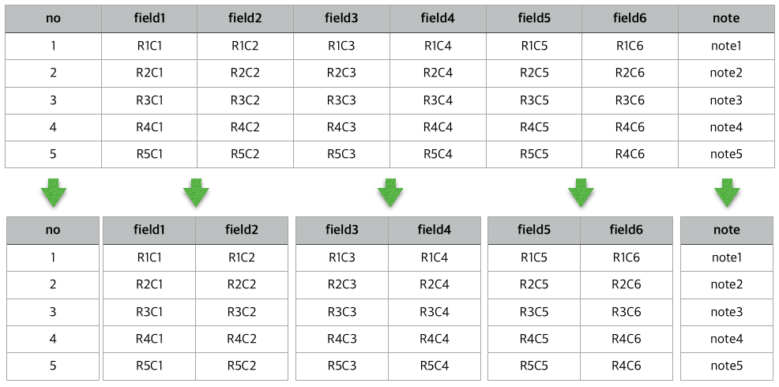
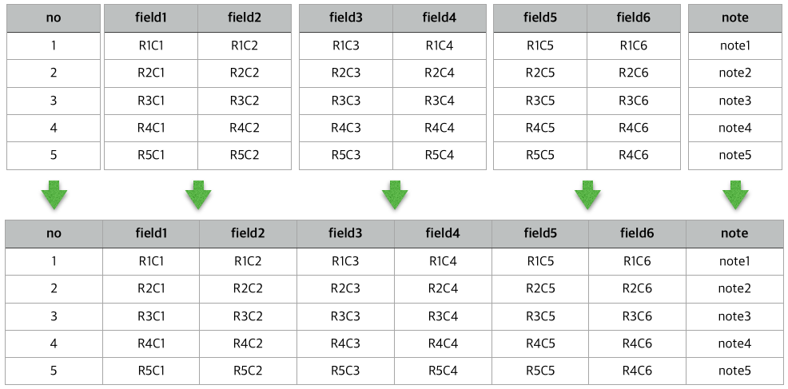

# Split and merge CSV

## Usage

### Split

    [python3] ./split.py src.csv nbody [nhead [ntail]]

Splits a file `src.csv` and stores into several files `src_N.csv`,
where `N` = 0, 1, ...,
some zeros are padded in front of the numbers to sort file easily
Each file will contain `nbody` columns. If `nhead` and `ntail` are specified,
a file `src_head.csv` containing the leftmost `nhead` columns
and a file `src_tail.csv` containing the rightmost `ntail` columns
will be generated.

### Merge

    [python3] ./merge.py src1 src2 dest

Merges files `src1` and `src2` and stores into a file `dest`.

## Note

* Each row in a file must have the same number of fields
* Two source files to be merged should have the same number of rows
* This program does not guarantee any loss of data 

